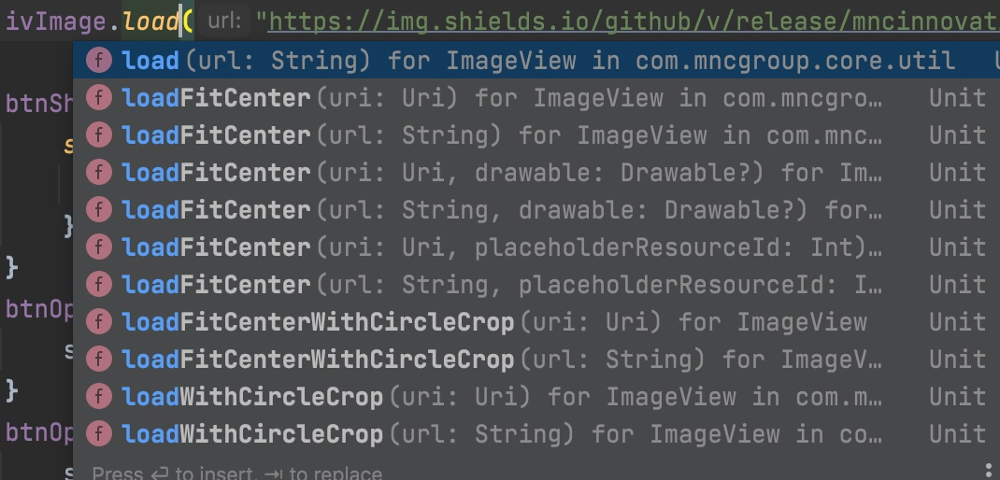
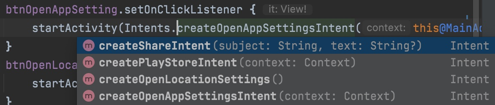
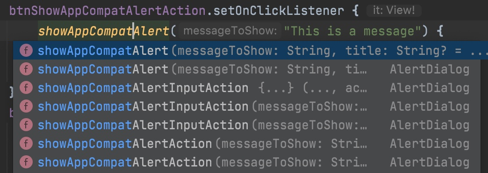

# Android Code Standard Core Library 

## Core Features

* Analytics Repository interface to implemented in app project
* Commons utils and extention
* Support MVVM pattern with BaseViewModel
* Network Configuration
* WebViewActivity used/ call this directly to show webview
* BaseActivity and BaseFragment

## How to use

### Add to Project

Gradle

```
allprojects {
  repositories {
    ...
    maven { url 'https://jitpack.io' }
  }
}

dependencies {
  implementation 'com.github.mncinnovation:mnc-android-code-standard-core:0.1.3'
}
```

or Maven

```
<repositories>
  <repository>
    <id>jitpack.io</id>
    <url>https://jitpack.io</url>
  </repository>
</repositories>

<dependency>
  <groupId>com.github.mncinnovation</groupId>
  <artifactId>mnc-android-code-standard-core</artifactId>
  <version>0.1.3</version>
</dependency>
```

### Implementation

1. BaseActivity

```kotlin
class MainActivity : BaseActivity() {
    private lateinit var binding: ActivityMainBinding

    override fun onCreate(savedInstanceState: Bundle?) {
        super.onCreate(savedInstanceState)

        showToolbarBack(false)
        showToolbarTitle(false)
    }
}
```

2. BaseViewModel

- Handle Result<Any> from com.mncgroup.core.network.Result<T : Any> (To Handle result from any data model)
- Common live event, like _isLoading, showErrorDialog, navigateToLogin and more.

```kotlin
class LoginViewModel constructor(
    private val authRepository: AuthRepository,
    userRepository: UserRepository
) : BaseViewModel() {

    val userData: LiveData<List<UserModel>> = userRepository.getUserLiveData()

    @OptIn(DelicateCoroutinesApi::class)
    fun authLogin(email: String, password: String) {
        _isLoading.value = true
        GlobalScope.launch(Dispatchers.Main) {
            val result = authRepository.requestLogin(LoginRequest(email, password))
            result.handle {
                //handle result ok
                _isLoading.value = false
            }
        }
    }
}
```

3. WebViewActivity, an activity class to show webview. You can use ``WebViewActivity``
   directly from your project.

```kotlin
    val headers: MutableMap<String, String> = mutableMapOf()
   headers["token"] = "5454wvybw9y9"
   startActivity(
       Intent(this@MainActivity, WebViewActivity::class.java)
           .apply {
               putExtra(EXTRA_TITLE, "Webview")
               putExtra(EXTRA_HEADERS, headers.toMap() as Serializable)
               data = Uri.parse("https://cloud.google.com/speech-to-text/docs/libraries")
           }
    )
```

4. Load Image Easy load image by accessing GlideUtils.kt
   

```kotlin
    ivImage.load("https://img.shields.io/github/v/release/mncinnovation/mnc-android-code-standard-core.svg?label=latest")
```

5. Snackbar

```kotlin
    btnShowSnackbar.setOnClickListener {
    showSnackbar(it, "Ini snackbar") {
        Toast.makeText(this@MainActivity, "closed snackbar", Toast.LENGTH_SHORT).show()
    }
}
```

6. Intens There is an Intents object that contain functions that return Intent
   

```kotlin
    btnOpenLocationSetting.setOnClickListener {
    startActivity(Intents.createOpenLocationSettings())
}
```

7. AppCompatAlert Show appCompatAlert or with action, or with input action.
   

```kotlin
    btnShowAppCompatAlertAction.setOnClickListener {
    showAppCompatAlert("This is a message") {
        Toast.makeText(this@MainActivity, "Test", Toast.LENGTH_SHORT).show()
    }
}
```

8. Date Picker
```kotlin
   btnShowDatePicker.setOnClickListener {
    showDatePickerAction(null, null) { day, month, year ->
        Toast.makeText(
            this@MainActivity, "selected date is " + day +
                    " / " + month +
                    " / " + year, Toast.LENGTH_SHORT
        ).show()
    }.show()
}
```

9. Permissions Check any permissions and request permissions.

```kotlin
    private fun checkPermissionOrOpenCamera() {
    when (checkPermissionsAll(
        listOf(
            Manifest.permission.CAMERA,
            Manifest.permission.WRITE_EXTERNAL_STORAGE
        )
    )) {
        PermissionResult.Granted -> openFileChooser()
        PermissionResult.DialogNeeded, PermissionResult.NeedRequest -> {
            requestPermissions(
                RC_CAMERA,
                Manifest.permission.CAMERA,
                Manifest.permission.WRITE_EXTERNAL_STORAGE
            )
        }
    }
}

```

10. Internet Util
This is an object to help app check internet connection.
First need to init in application class.
```kotlin
class AppNameApplication : Application() {
    override fun onCreate() {
        super.onCreate()
        //init internet util
        InternetUtil.init(this)
    }
}
```

And to use it call ``runIfConnectedOrResultException`` and place call of function API at the body like this sample.

```kotlin

interface AuthRepository {
    suspend fun requestLogin(request: LoginRequest): Result<LoginResponse>
}

class AuthRepositoryImpl(private val authApi: AuthApi, private val userRepository: UserRepository) :
    AuthRepository {
    @OptIn(ExperimentalCoroutinesApi::class)
    override suspend fun requestLogin(request: LoginRequest): Result<LoginResponse> {
        return runIfConnectedOrResultException {
            authApi.loginUser(request).awaitResult() {
                userRepository.updateUser(this.user)
                this
            }
        }
    }
}
```

11. View Extensions
Common functions for view configurations.
- ``View.hideKeyboard()`` and ``View.showKeyboard()``
- ``View.toBitmap()``
- ``Boolean?.toVisibleOrGone()``
- ``Boolean?.toVisibleOrInvisible()``
- ``Context.dip(value: Int)``

12. Arguments
  Start an Activity for given class T and allow to work on intent with "run" lambda function
- ``<T : Fragment> T.withSerializable(vararg arguments: Pair<String, Serializable>)``
- ``<T : Fragment> T.withParcelable(vararg arguments: Pair<String, Parcelable>): T``
  Retrieve property from intent
- ``<T : Any> AppCompatActivity.argument(key: String) : T``
- ``<T : Any> AppCompatActivity.argument(key: String, defaultValue: T? = null) : T``
- ``<T : Any> AppCompatActivity.argumentNotNull(key: String, defaultValue: T) : T``
- ``<T : Any> Fragment.argument(key: String) : T``
- ``<T : Any> Fragment.argument(key: String, defaultValue: T? = null) : T``
- ``<T : Any> Fragment.argumentNotNull(key: String, defaultValue: T) : T``
13. ConfigUtils
Configuration for resources locale
- ``Context.updateResourcesLocale(locale: Locale): Context``
- ``Context.updateResourcesLocaleLegacy(locale: Locale): Context``
- ``Context.updateBaseContextLocale(locale: Locale): Context``
- ``Context.updateResourcesLocale(body: Configuration.() -> Unit): Context``
- ``Context.updateBaseContextLocaleWithoutChange(locale: Locale): Context``

## License

```
Copyright 2021 MNC Innovation Center

Proprietary license
```
